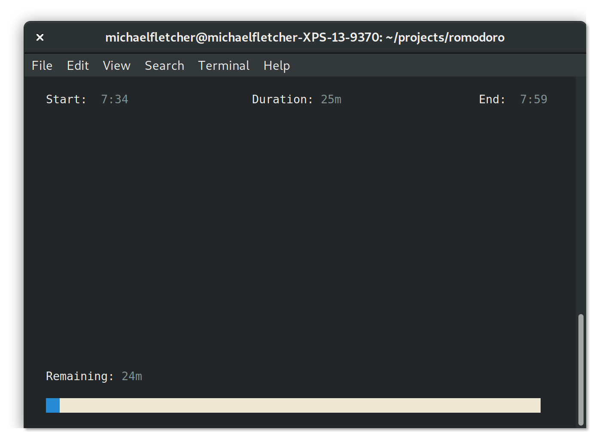

# romodoro

Romodoro is a terminal Pomodoro timer.

## Quick Start

 * Install Rust (https://www.rust-lang.org/tools/install).
 * ```cargo install romodoro```
 * ```$ romodoro```



## Acknowledgements

Romodoro was inspired by Carl Johnson's pomodoro written in Go. (https://github.com/carlmjohnson/pomodoro).